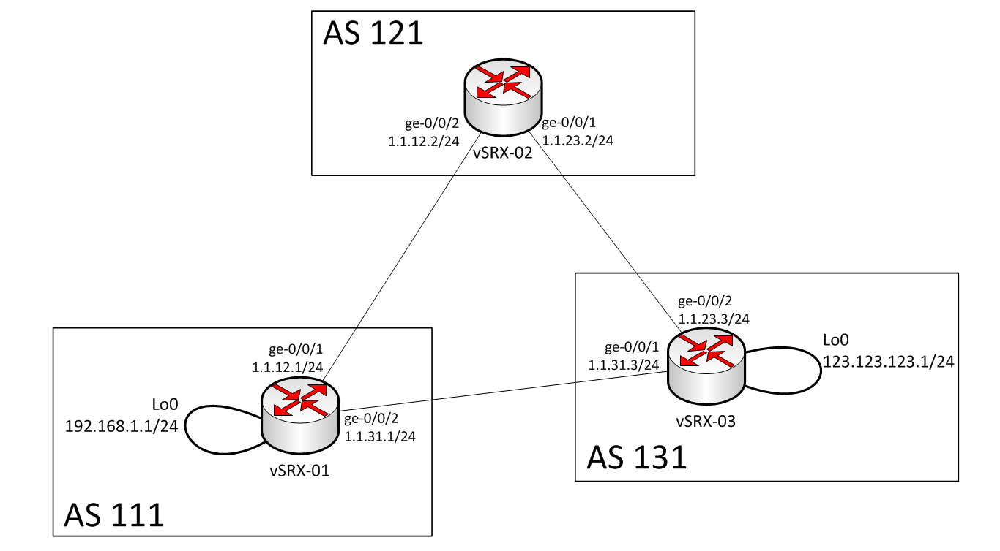

## Practical Network Automation with Ansible and Python

###Matt Oswalt
###@Mierdin
###keepingitclassless.net

---

# Disclaimers

<!--
Just a disclaimer on what I'll be covering....in short,
I do have a day job, and this is not that.
-->

Nothing in this presentation should be viewed to reflect any opinion or infrastructure detail of any employer, past or present, or any other organization. What I present is mine and mine alone.

Details provided should not be perceived to reflect the actual design or configuration of any specific real-world technology or infrastructure deployment, unless otherwise explicitly stated.

---

# Workshop Outline

- Brief Intro to Network Automation concepts
- Basic Data Modeling with YAML
- Creating templates with Jinja2
- Provisioning Network Services with Ansible
- Network Automation with Python Tools

---

# Workshop Tips

- ALL material online (including detailed walkthrough)
- Take light notes if you have to, but stay engaged
- Stop me for questions or clarifications at any time

---

---

# Parting Thoughts

- Use these tools in a CI Pipeline (Git + Jenkins)
- Start SIMPLE, work up from there
- Communication and buy-in is KEY!

---

# Resources

- EVERYTHING is here: https://github.com/Mierdin/nwkauto
- Much more YAML, Jinja2, Ansible, Python to explore

